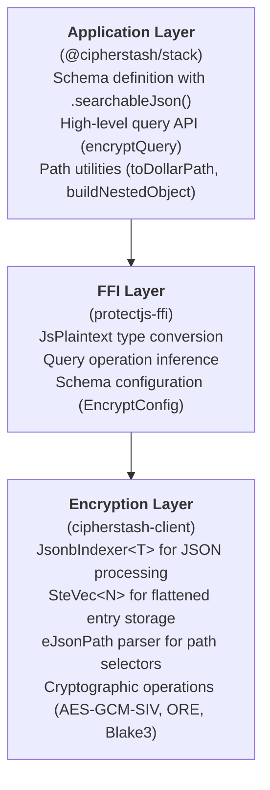
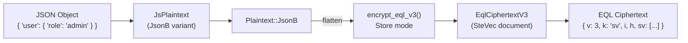
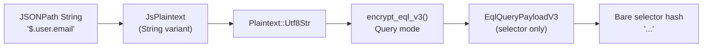
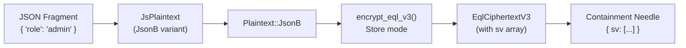

# JSONB Integration Guide

This guide provides a comprehensive overview of JSONB encryption and querying in protectjs-ffi.

## Table of Contents

1. [Architecture Overview](#architecture-overview)
2. [Data Flow](#data-flow)
3. [SteVec Flattening Process](#stevec-flattening-process)
4. [Quick Start](#quick-start)

---

## Architecture Overview

The JSONB encryption system consists of three layers:



### Key Components

| Component | Location | Purpose |
|-----------|----------|---------|
| `JsPlaintext` | `crates/protect-ffi/src/js_plaintext.rs` | JavaScript value representation |
| `EncryptConfig` | `crates/protect-ffi/src/encrypt_config.rs` | Schema configuration |
| `to_query_plaintext` | `crates/protect-ffi/src/lib.rs` | Query type inference |
| `JsonbIndexer` | `cipherstash-client` | JSON to SteVec conversion |
| `SteVec` | `cipherstash-client` | Flattened encrypted entries |

---

## Data Flow

### Storage Path (encrypt/encryptBulk)

When storing JSONB data, the flow is:



**Key Points:**
- `EqlOperation::Store` is used
- The document key header (`h`) is stored once for decryption
- SteVec entries (`sv`) carry the selector (`s`) and raw AEAD ciphertext (`c`)
- Ordered string/number path entries may also carry an `op` term

**Update Semantics:**
- There is **no partial in-place update** of encrypted JSON fields
- To update, re-encrypt the entire JSON value and overwrite the column
- Individual nested fields cannot be modified without re-encrypting the whole document

### Query Path (encryptQuery/encryptQueryBulk)

Query encryption follows different paths based on query type:

#### Path Selector Query (ste_vec_selector)



**Output:** The bare selector hash as a string, with no ciphertext.

#### Containment Query (default)



**Output:** An `eql_v3.query_json` needle containing only `{sv: [{s, op?}]}`.
The document envelope (`v`, `k`, `i`, `h`) and entry ciphertext (`c`) are
removed before the needle crosses the FFI boundary.

---

## SteVec Flattening Process

When JSON is encrypted with a `ste_vec` index, it is "flattened" into a vector of entries. Each entry represents a path-value pair in the JSON structure.

### Example Flattening

**Input JSON:**
```json
{
  "user": {
    "name": "alice",
    "age": 30,
    "tags": ["admin", "moderator"]
  }
}
```

**Flattened Entries (conceptual):**

| Path | Value | Index Fields |
|------|-------|--------------|
| `$.user.name` | `"alice"` | s, c, op |
| `$.user.age` | `30` | s, c, op |
| `$.user.tags[0]` | `"admin"` | s, c, a=true, op |
| `$.user.tags[1]` | `"moderator"` | s, c, a=true, op |

### Index Fields in SteVec Entries

| Field | Name | Purpose | Generated For |
|-------|------|---------|---------------|
| `s` | Selector | Path or path-and-value identifier | All entries |
| `op` | OPE term | Ordering comparison | Ordered string/number path entries |
| `a` | Array Flag | Indicates array membership | Array elements |
| `c` | Ciphertext | Encrypted value | All entries |

---

## Quick Start

### 1. Configure Schema

```typescript
// Using protectjs-ffi directly
const encryptConfig = {
  v: 1,
  tables: {
    users: {
      profile: {
        cast_as: 'json',
        indexes: {
          ste_vec: { prefix: 'users/profile' }
        }
      }
    }
  }
}
```

### 2. Initialize Client

```typescript
import { newClient } from '@cipherstash/protect-ffi'

const client = await newClient({ encryptConfig })
```

### 3. Encrypt JSON for Storage

```typescript
import { encrypt } from '@cipherstash/protect-ffi'

const ciphertext = await encrypt(client, {
  plaintext: { user: { role: 'admin', name: 'alice' } },
  table: 'users',
  column: 'profile'
})

// Result: { v: 3, k: 'sv', i, h, sv: [{ s, c, a?, op? }, ...] }
```

### 4. Encrypt Path Selector Query

```typescript
import { encryptQuery } from '@cipherstash/protect-ffi'

// For field access queries (e.g., jsonb_path_query)
const selector = await encryptQuery(client, {
  plaintext: '$.user.name',
  table: 'users',
  column: 'profile',
  indexType: 'ste_vec',
  queryOp: 'ste_vec_selector'  // Or use 'default' with string
})

// Result: "..." (the bare selector hash)
```

### 5. Encrypt Containment Query

```typescript
import { encryptQuery } from '@cipherstash/protect-ffi'

// For containment queries (e.g., @> operator)
const query = await encryptQuery(client, {
  plaintext: { user: { role: 'admin' } },
  table: 'users',
  column: 'profile',
  indexType: 'ste_vec',
  queryOp: 'default'
})

// Result: { sv: [{ s, op? }, ...] }
```

### 6. Use with SQL

```sql
-- Path selection / extraction
SELECT profile -> $1::text FROM users;

-- Containment
SELECT * FROM users
WHERE profile @> $1::jsonb::eql_v3.query_json;
```

---

## @cipherstash/stack Higher-Level API

If using the full [`@cipherstash/stack`](https://github.com/cipherstash/stack) library (not just protect-ffi directly), you get additional convenience patterns:

| @cipherstash/stack Pattern | Translates To | Output |
|-------------------|---------------|--------|
| `{ path: "user.email" }` | `encryptQuery` with `$.user.email` selector | bare selector string |
| `{ path: "user.role", value: "admin" }` | `encryptQuery` with `ste_vec_value_selector` | `{ sv: [{ s }] }` |
| `{ contains: { role: "admin" } }` | `encryptQuery` with term | `{ sv }` |
| `{ containedBy: { role: "admin" } }` | `encryptQuery` with term | `{ sv }` |

**Note:** Path+value queries use a value-inclusive selector and return a
one-entry containment needle. General object/array containment still flattens
the supplied JSON fragment into a multi-entry needle.

See the [@cipherstash/stack source](https://github.com/cipherstash/stack) for implementation details.

---

## Next Steps

- [API Reference](./jsonb-api-reference.md) - Detailed API documentation
- [Troubleshooting](./jsonb-troubleshooting.md) - Common issues and solutions
